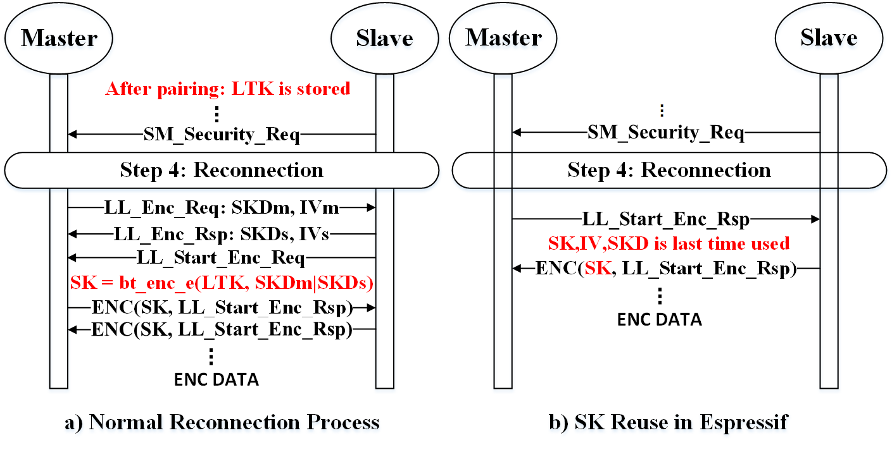

# Security Vulnerability Report: Session Key Reuse in Bluetooth Reconnection

## 1. **Vulnerability Summary**
During the reconnection process, the device is expected to generate a new session key (SK) using the Long-Term Key (LTK) from the previous connection and a newly exchanged Session Key Diversifier (SKD). This ensures that each session maintains confidentiality and integrity using AES-CCM encryption. However, we identified a critical security flaw where the device reused the old session key (SK) instead of generating a new one. This deviation from the expected security protocol allows attackers to exploit the vulnerability, potentially leading to a security bypass attack.

## 2. **Affected Component**
- **Bluetooth Link Layer Encryption Process**
- **Affected Message:** `LL_Start_Enc_Rsp`
- **Encryption Mechanism:** AES-CCM
- **Affected Product Code Base:** Esp idf - v5.3.0
- **Affected Chip:** Esp32-WROOM-32E

## 3. **Technical Details**

1. **Expected Behavior**  
   - When a device reconnects, it should exchange a new SKD and derive a fresh SK using the stored LTK.  
   - The new SK is then used for AES-CCM encryption to secure Link Layer data.

2. **Observed Deviation**
   - Upon receiving the `LL_Start_Enc_Rsp` PDU, the device encrypted and returned this message using the **old SK from the previous connection**, rather than generating a new SK.  
   - This behavior indicates that the device bypassed the standard key derivation process, allowing encryption with an expired session key.

3. **Persistence After Firmware Update**
   - Even after reprogramming the device firmware, it continued to accept and communicate using the old SK.  
   - This confirms that the session key reuse was not an accidental implementation bug but a fundamental flaw in the encryption key handling process.

## 4. **Security Implications**
- **Loss of Forward Secrecy:** Since the device reuses the SK, an attacker with access to a previous session key could decrypt future communication.
- **Replay Attack Potential:** An adversary could capture encrypted packets and replay them in a subsequent session without the need for fresh encryption.
- **Man-in-the-Middle (MitM) Attack Feasibility:** A malicious actor who intercepts the old session key could use it to impersonate a legitimate device during reconnection.
- **Bypassing Authentication:** Devices relying on the integrity of session key updates could be tricked into maintaining an insecure connection.

## 5. **Exploitation Scenario**
1. **Step 1:** The attacker eavesdrops on an existing encrypted connection and stores the session key.
2. **Step 2:** The victim device disconnects and later attempts to reconnect.
3. **Step 3:** Instead of negotiating a new session key, the device incorrectly continues using the old SK.
4. **Step 4:** The attacker, possessing the old SK, can decrypt new communication, inject malicious packets, or impersonate a trusted device.

## 6. **Recommendations & Mitigation Strategies**
- **Enforce New SK Generation:** The device must strictly derive a fresh session key for each reconnection, ensuring that the old SK is invalidated.
- **Patch Firmware Logic:** Modify the firmware to ensure that `LL_Start_Enc_Rsp` is never encrypted using a previous session key.

## 7. **Conclusion**
This vulnerability exposes Bluetooth connections to potential attacks by allowing unauthorized reuse of session keys. If exploited, an attacker could decrypt and manipulate communication, undermining the integrity and confidentiality of the connection. Immediate mitigation is recommended to align the encryption process with secure key management practices.

---
  
**Date:** March 13, 2025  