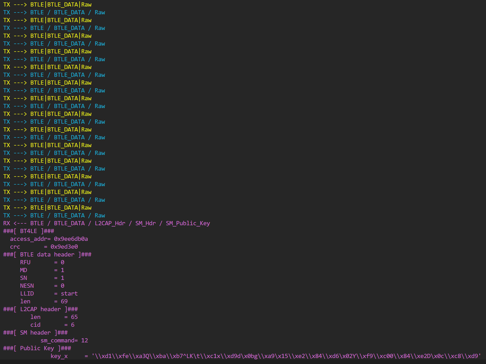

# Vulnerability Report: Improper Validation of BLE PDU Length in Realtek RTL8762E SDK

## 1. Summary

A vulnerability was discovered in the **Realtek RTL8762EKF-EVB** platform running **RTL8762E SDK V1.4.0**. The implementation lacks strict validation of incoming Bluetooth Low Energy (BLE) data packet lengths at the Link Layer. Although the Bluetooth Core Specification mandates a minimum valid PDU length of 27 bytes, the affected SDK improperly accepts and processes fragmented packets smaller than this threshold. This allows attackers to flood the target with undersized PDUs, exhausting system resources and leading to degraded performance or a denial of service (DoS).

---

## 2. Affected Component

- **Vendor**: Realtek  
- **Device**: RTL8762EKF-EVB  
- **SDK Version**: RTL8762E SDK V1.4.0  
- **Component**: BLE Stack – PDU Reception and Fragment Handling

---

## 3. Vulnerability Details

### 3.1 Description

According to the Bluetooth Core Specification, the minimum payload length for valid data PDUs is 27 bytes. However, the Realtek RTL8762E implementation does not enforce this constraint and allows BLE packets with significantly smaller payloads (e.g., 1–5 bytes). For compatibility reasons, the stack may accept fragmented packets, but this behavior becomes a liability when exploited.

An attacker can continuously transmit minimal-length PDUs, forcing the device to expend excessive CPU and memory resources on processing them, ultimately degrading communication performance.

Moreover, if the attacker initiates multiple concurrent pairing or connection attempts, each transmitting undersized PDUs—the compounded load can quickly exhaust the device’s available memory and stack resources. This leads to severe service degradation and may render the device temporarily unresponsive.

### 3.2 Root Cause

The BLE stack does not properly enforce a minimum length check for received data packets. This violates protocol expectations and allows adversaries to exploit low-efficiency communication paths without triggering connection errors.

---

## 4. Proof of Concept (PoC)
Full details and scripts are available [Improper_Validation_of_BLE_PDU_Length.py](./Improper_Validation_of_BLE_PDU_Length.py).
1. Establish a BLE connection with the RTL8762EKF-EVB.  
2. Send a sequence of data packets each shorter than 27 bytes (e.g., 5 bytes).  
3. Observe increased CPU usage and deteriorating BLE throughput.  

---

## 5. Steps to Reproduce

1. Flash RTL8762E SDK v1.4.0 firmware to the RTL8762EKF-EVB.  
2. Use a BLE central tool capable of sending raw packets.
3. Establish a connection and start sending a rapid stream of PDUs < 27 bytes.  

4. Monitor device stability, CPU load, and data loss behavior.

---

## 6. Security Impact

- **Vulnerability Type**: Denial of Service (DoS)  
- **Impact**: BLE communication breakdown, high resource consumption  
- **Attack Vector**: BLE wireless proximity  
- **Authentication Required**: No  
- **User Interaction Required**: No

---

## 7. Attack Vectors

The attacker does not rely on negotiating `LL_LENGTH_REQ`. Instead, they send a sustained flood of undersized PDUs that are technically accepted by the device due to weak input validation. These packets are inefficient by design, but they force the stack to process them as normal traffic, gradually leading to a service degradation or failure.

Additionally, by launching multiple simultaneous BLE connection or pairing sessions, each injecting small data packets, the attacker can amplify the load and rapidly drain memory, buffers, and processing power—causing the system to become unresponsive.

---
## 8. References

- Bluetooth Core Specification v5.3 – Vol 6, Part B  
- https://www.realtek.com  
- http://rtl8762ekf-evb.com  

---

## 9. Suggested Fix

- Implement strict lower-bound validation for incoming PDU payload lengths (≥27 bytes).  
- Discard or flag data packets that do not meet BLE specification requirements.  
- Rate-limit and monitor small-packet floods to prevent processing overload.  
- Add logging to detect abnormal PDU reception patterns for future hardening.
