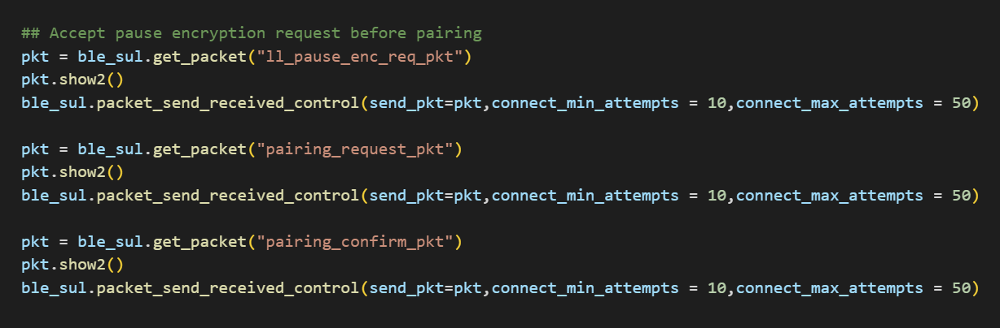
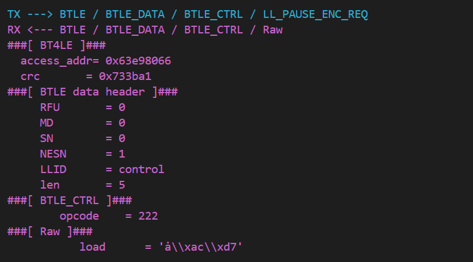
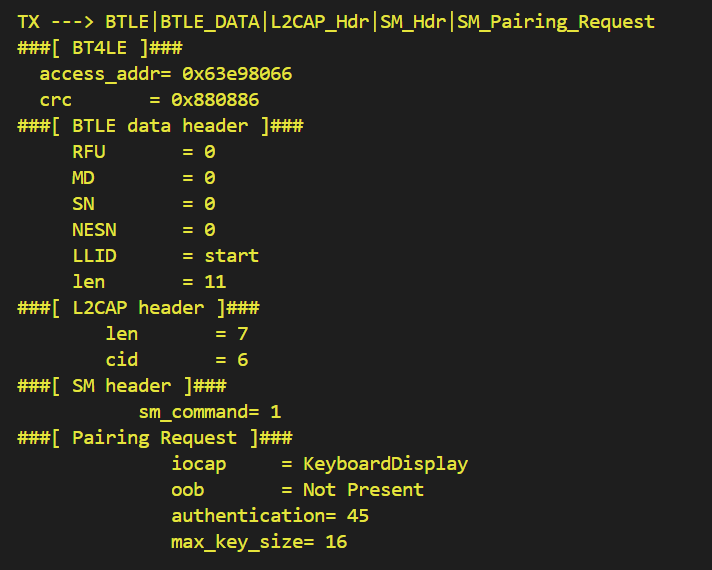

# Vulnerability Report: Premature Encryption Pause Attack on LP-CC2652RB

## 1. **Vulnerability Summary**
A vulnerability was identified in the LP-CC2652RB Bluetooth Low Energy (BLE) SoC, where the device incorrectly accepts an unencrypted LL_PAUSE_ENC_REQ packet during the connection phase. This triggers the Encryption Pause procedure before encryption has been properly established, leading to protocol state corruption and a denial of service condition. This behavior violates the Bluetooth Core Specification and allows remote attackers to disrupt the authentication process.

## 2. **Affected Component**
- **Device**: Texas Instruments LP-CC2652RB  
- **Protocol Layer**: Link Layer (LL)  
- **Packet**: `LL_PAUSE_ENC_REQ` (Opcode: 0x0A)  
- **SDK Version**: SimpleLink CC13XX CC26XX SDK 7.41.00.17

## 3. **Vulnerability Details**

### Description
During the BLE connection establishment process, an attacker can inject an unencrypted `LL_PAUSE_ENC_REQ` packet before the encryption procedure has completed (i.e., before `LL_START_ENC_REQ` is sent). The LP-CC2652RB incorrectly accepts this control packet and transitions into an encryption pause state, violating the expected Link Layer state machine.

### Impact
- The device enters an inconsistent state where encryption cannot be completed.
- Future pairing or secure communication fails.
- Affected sessions are dropped or indefinitely stalled.
- Repeated exploitation may lead to Denial of Service (DoS) or degraded BLE functionality.

### Root Cause
The device fails to verify whether encryption is currently active before accepting `LL_PAUSE_ENC_REQ`, violating the following specification requirement:

> **Bluetooth Core Spec v5.3, Vol 6, Part B, Section 5.1.3:**  
> “The Encryption Pause procedure may only be initiated after the connection is encrypted. A device receiving LL_PAUSE_ENC_REQ prior to encryption shall reject it.”

## 4. **Proof of Concept (PoC)**
A proof-of-concept has been developed to reproduce the issue. The PoC initiates a BLE connection and injects an unencrypted `LL_PAUSE_ENC_REQ` packet before encryption has begun, resulting in session disruption. Full details and scripts are available [Accept_Pause_Enc_Req.py](./Accept_Pause_Enc_Req.py).

## 5. **Steps to Reproduce**
1. Initiate a BLE connection to LP-CC2652RB.
2. Before `PAIRING_REQUEST` is received, inject a raw unencrypted `LL_PAUSE_ENC_REQ`.

3. Observe that the device accepts the packet and fails to continue the pairing process.

## 6. **Security Impact**

- **Attack Vector**: Remote (over-the-air, during pairing)  
- **Impact**: Connection hijack prevention, authentication failure, DoS  

## 7. **Suggested Fix**
- Validate that encryption is active before accepting any `LL_PAUSE_ENC_REQ` packet.
- Implement a state check before transitioning to the encryption pause procedure.
- Drop or reject any control packets that violate protocol sequencing rules.

## 8. **References**
- **Bluetooth Core Specification v5.3**:  
  Vol 6, Part B – Link Layer Control Procedures, Section 5.1.3  
- **LL Control Opcode Table**: Opcode 0x0A = `LL_PAUSE_ENC_REQ`